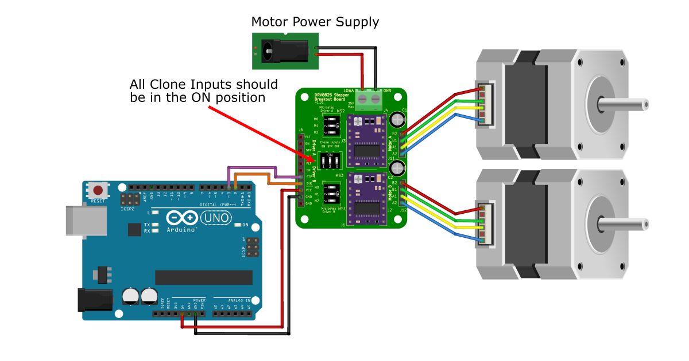

---
tags:
  - DRV8825
---

[:fontawesome-solid-arrow-left: Go Back To __Microstepping__](../DRV8825%20Breakout%20Board/microstepping.md)
{ .card }

[Go Back To __Introduction__ :fontawesome-solid-arrow-right:](../DRV8825%20Breakout%20Board/Introduction.md)
{ .card }

---
# Cloning Inputs
You may have an application where you have two motors working together where they are moving at the same speed and direction, simultaneously. A method to achieve this is by sending the same input signals to the same two drivers.

The breakout board is equiped with a 3-position switches that allows you to connect the `STP`, `DIR`, and `EN` pins from one drive to the other, reducing the number of connections you would need to make from the Arduino to the board.

---
## Cloned input example
### Pin Connections
Prepare the breakout board with two motors and two drivers with the current limit already set. You only need to connect one set of `DIR` and `STP` pins to the board.Set all the clone input switches to the `ON` position.

Make sure the microstep configuration is set to full-step (or at least the same setup) so that they turn the same amount of steps

<figure markdown="span">
  { max-width="100%" height: auto; loading="lazy";}
  <figcaption>Final pin connections to run the quick start code</figcaption>
</figure>

### Code

Copy the code from [quick-start example](../DRV8825%20Breakout%20Board/Quick%20Start.md) and run it. The stepper motors should turn simulataneously at the same speed and position.

---

[:fontawesome-solid-arrow-left: Go Back To __Microstepping__](../DRV8825%20Breakout%20Board/microstepping.md)
{ .card }

[Go Back To __Introduction__ :fontawesome-solid-arrow-right:](../DRV8825%20Breakout%20Board/Introduction.md)
{ .card }

