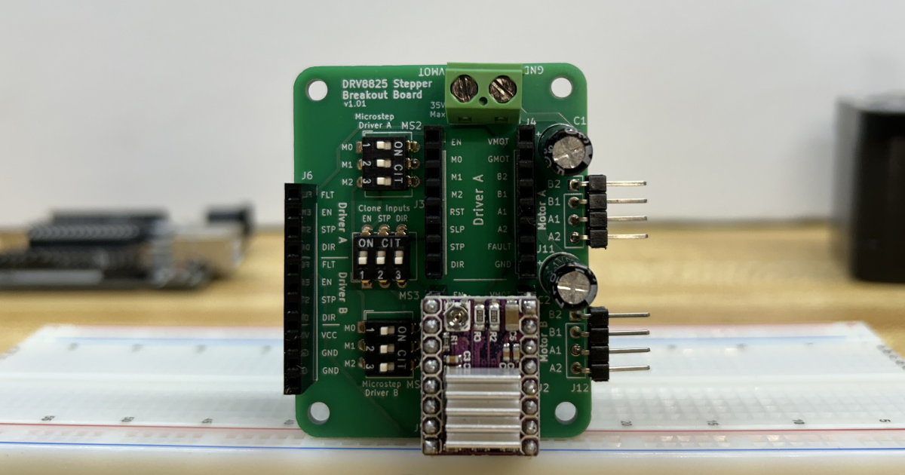
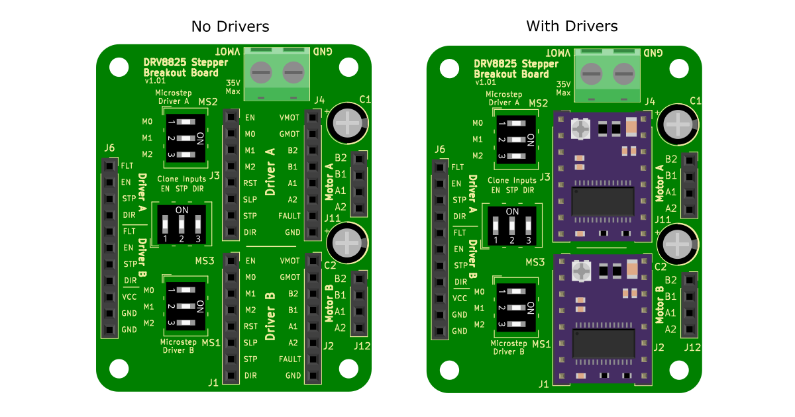
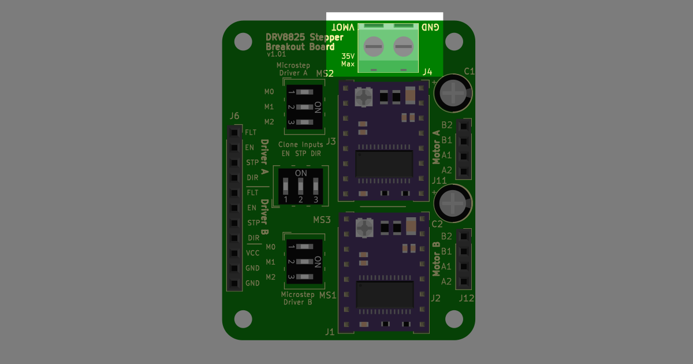
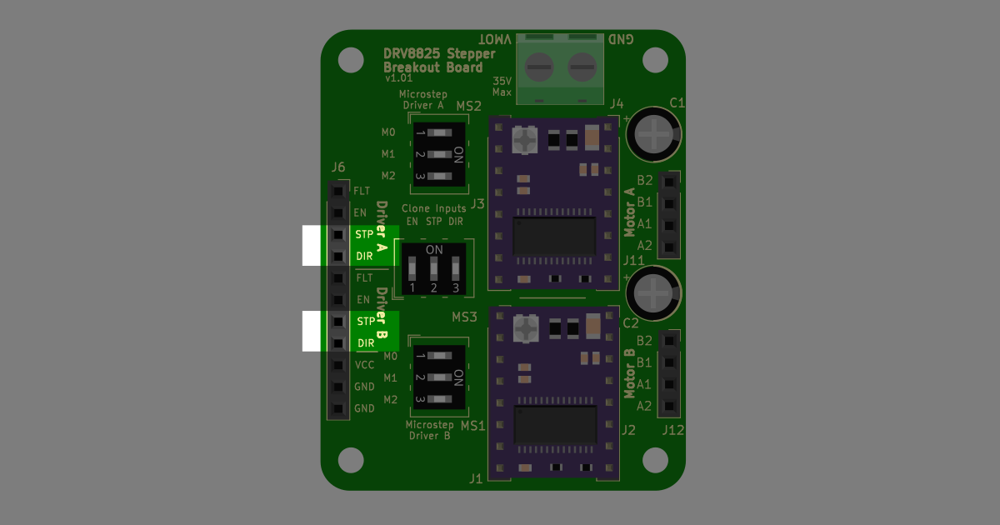
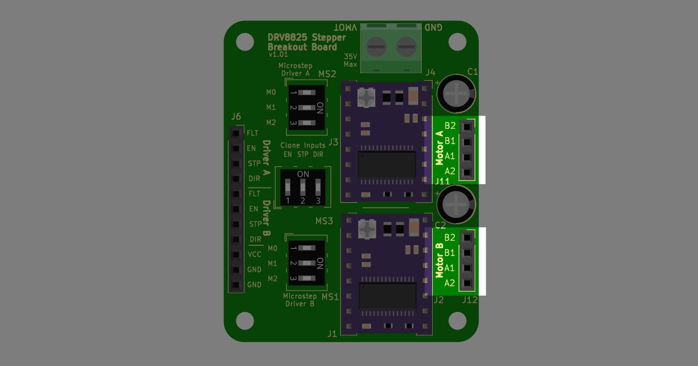
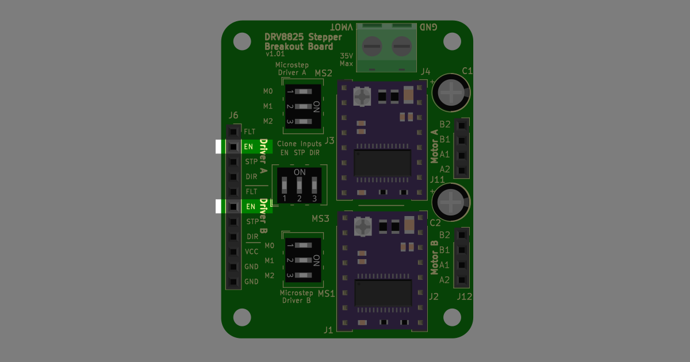
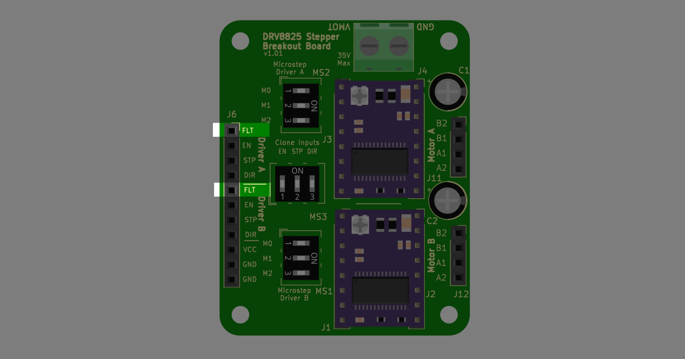
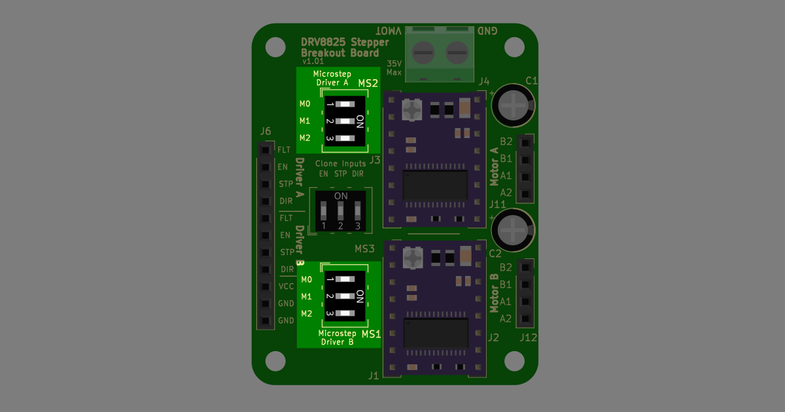
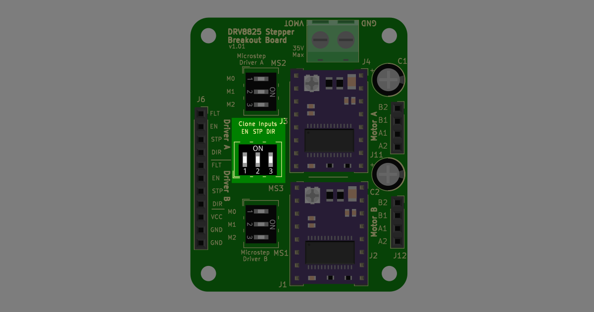

---
tags:
  - DRV8825
---

[:fontawesome-solid-house: Go Back To __Home__](../index.md)
{ .card }

[Go Next To __Quick Start__ :fontawesome-solid-arrow-right:](../DRV8825%20Breakout%20Board/Quick%20Start.md)
{ .card }

---

# Introduction

The DRV8825 is a specialized stepper motor driver that offers a straightforward, reliable, and precise way to control a stepper motor with a microcontroller like an Arduino. These qualities make the DRV8825 an ideal solution for applications requiring precise motion control, such as CNC machines, 3D printers, automation, and more.

<figure markdown="span">
  { max-width="100%" height: auto; loading="lazy";}
  <figcaption>DRV8825 stepper motor driver and breakout board</figcaption>
</figure>

To further simplify the use of these drivers, the DRV8825 Breakout Board by [Gabe Builds](../store.md) allows for easy connection, setup, and operation of the DRV8825 stepper motor drivers without the need for a breadboard.

## About DRV8825
The DRV8825 chip is a stepper motor driver manufactured by Texas Instruments, designed to control bipolar stepper motors.

Key features of the DRV8825 include:

*   Output motor capacity of up to 45V and 2.5A per coil
*   Reduces noise from the stepper motors.
*   Control pins are simplified to two pins: step and direction
*   Six micro stepping resolutions: full-step, ½-step, ¼-step, 1/8-step, 1/16-step, and 1/32-step
*   Under-voltage, shoot-through, short circuit, overcurrent, and thermal protections

More information can be found on Texas Intsrument's DRV8825 Datasheet:

[DRV8825 Datasheet  :fontawesome-solid-file-zipper:](https://www.ti.com/lit/ds/symlink/drv8825.pdf?ts=1720237745203&ref_url=https%253A%252F%252Fwww.ti.com%252Fproduct%252FDRV8825%253Futm_source%253Dgoogle%2526utm_medium%253Dcpc%2526utm_campaign%253Dasc-null-null-GPN_EN-cpc-pf-google-wwe_cons%2526utm_content%253DDRV8825%2526ds_k%253DDRV8825+Datasheet%2526DCM%253Dyes%2526gad_source%253D1%2526gclid%253DCj0KCQjws560BhCuARIsAHMqE0GsHTqW24IqROCPRnwzSn7l6Ay8JlEYDAlh1axdGG6Je3KpoHpkwN0aAg0KEALw_wcB%2526gclsrc%253Daw.ds%2526bm-verify%253DAAQAAAAJ_____zNXEWRBJsoOr8MEB5qkcDdNKufPgrTceCpTQxFAOv3dlDzVD-9nMyJZ5wlrwQUUZWBZviPdKyemsycvUALFJ-2foT-6qYH8Q2iKsFb7rmFMV3uksB_ddth6ycQL0uKdfx3_8ts4EF7phGjT9-aFIdkjVWOjFvvbla8-R8s_eFIUo2fKJb1nuP1t9LWRkjR1G9VixFgcSdfbm6o48RaCASywrIOqjb_HpUmcztahaPgA19Cws1bZXA4J2rCGKl_eJn2u0Nx8jmj2iG7B1rNgfal4F7IN27XaITgL7ixF6qyajaTcG354Rd37PaoM2w3S1LdLZrq640S8qG411Og3pHy8NANfp1JCRs32NtLrSJ5bNe3JvnVgysr2c4L_T51Ja-3IyKN4SBrSX8Dn9goH1NQKm94mT3nZY7i7-f1QXWldhbTZcPJ0lkUA1H4gyj7hklh57wcBKe1PLJhFIe7D1WT6Kj4xUvBoh_mUhljN6o_DsIxpwFCuRYmhJ7ajQ26dVaohauF5KVKACt-JcTXs1W6Pe5bBiDlIqETBaz-u4rmQv7y0AI4e5fx3tzHJqQDHqc8C10gs-PWtTMq26jQX4l2rqKREqgdOyehqLgBBPRENO4qbjbR-oAOeh7awfAFMDix4riUK324bLpQMtw_x4G9MJBAlXHdx3_zOjAxlyxNQNrhohZy0tcCOQ-fxDANj316uHS-4NiPEnw){ .md-button .md-button--primary  }

## About the Breakout Board
The DRV8825 drivers readily available on the internet built to be used on a breadboard. These drivers require quite a few extra components and wire connections for prototyping, creating a spider web of wires on the breadboard. This is especially true when working with multiple stepper motor drivers.

The Advantages of using a breakout board includes:

  * Clearly labeled pin connections
  * Switches that simplify microstep resolution configuration and cloning control inputs, reducing extra wires
  * A built-in 100μF decoupling capacitor that reduces voltage spikes in the motor input

---

## Pin Overview
Place a DRV8825 stepper driver module on the breakout board. Make sure that the pins of the module match the pins of the breakout board

<figure markdown="span">
  { max-width="100%" height: auto; loading="lazy";}
  <figcaption>DRV8825 Breakout board with and without the motor drivers</figcaption>
</figure>

---

### Motor Power Connections
`VMOT` and `GMOT` are motor input voltage and motor ground, respectively. These power connections supply power to the motor and can have a voltage between 8.2V and 45V. Make sure to pick a power supply that can provide enough current to the motor(s) you power with it.

The motor power connections supplies power to all  the DRV8825 drivers placed on the board.

<figure markdown="span">
  { max-width="100%" height: auto; loading="lazy";}
  <figcaption>Motor Power Connections</figcaption>
</figure>

---

### Input Control Pins
`STP` and `DIR` are the input controls step and direction, respectively.

* Every time a HIGH pulse is sent to the step pin moves the motor by one step. The faster the step pin is pulsed, the faster the motor spins.
* Toggling of the direction pin changes the direction of the stepper motor.

<figure markdown="span">
  { max-width="100%" height: auto; loading="lazy";}
  <figcaption>Input Control Pins</figcaption>
</figure>

---

### Motor to Driver Connections
Pins `B2`, `B1`, `A1`, and `A2` are the motor connection for a Bi-polar stepper motor. 

* One coil of the stepper motor should be connected to `B2` and `B1`, and the other to `A1` and `A2`
* Most stepper motors have connectors that are setup to match this configuration. If not, you can verify which motor wire connections are on the same coil by refering to the manufactuer's datasheet or by using the continuity setting on a multimeter.

<figure markdown="span">
  { max-width="100%" height: auto; loading="lazy";}
  <figcaption>Driver to Motor Pins</figcaption>
</figure>

---

### Enable Pins
The Enable pin, or `EN`, are pins that disable or enable the motor driver to turn the stepper motor. Setting the enable pin HIGH disables the motor, while setting the enable pin LOW disables the motor.

<figure markdown="span">
  { max-width="100%" height: auto; loading="lazy";}
  <figcaption>Enable Pins</figcaption>
</figure>

---

### Fault Pins
The fault pins, or `FLT`, is a pin that returns LOW to the microcontroller when the driver is disabled due to over-current protection or thermal shutdown.

<figure markdown="span">
  { max-width="100%" height: auto; loading="lazy";}
  <figcaption>Fault Pins</figcaption>
</figure>

---

### Microstepping Switch
The breakout board has a switch, `M0`, `M1`, and `M2` that allows you to change the resolution of the stepper motor to move to more precise positions

<figure markdown="span">
  { max-width="100%" height: auto; loading="lazy";}
  <figcaption>Microstep configuration switches</figcaption>
</figure>

More on microstepping can be found [here](../DRV8825%20Breakout%20Board/microstepping.md).

---

### Clone Input Switch
The breakout board contains a 3-position dip switch that allows you to connect the control pins of one driver to the other. This allows two motors to recieve the same inputs from a microncontroller and work together simultaneously.

<figure markdown="span">
  { max-width="100%" height: auto; loading="lazy";}
  <figcaption>Clone inputs switche</figcaption>
</figure>

More on cloning inputs can be found [here](../DRV8825%20Breakout%20Board/Cloning%20Inputs.md)

---

[:fontawesome-solid-arrow-left: Go Back To __Home__](../index.md)
{ .card }

[Go Next To __Quick Start__ :fontawesome-solid-arrow-right:](../DRV8825%20Breakout%20Board/Quick%20Start.md)
{ .card }

