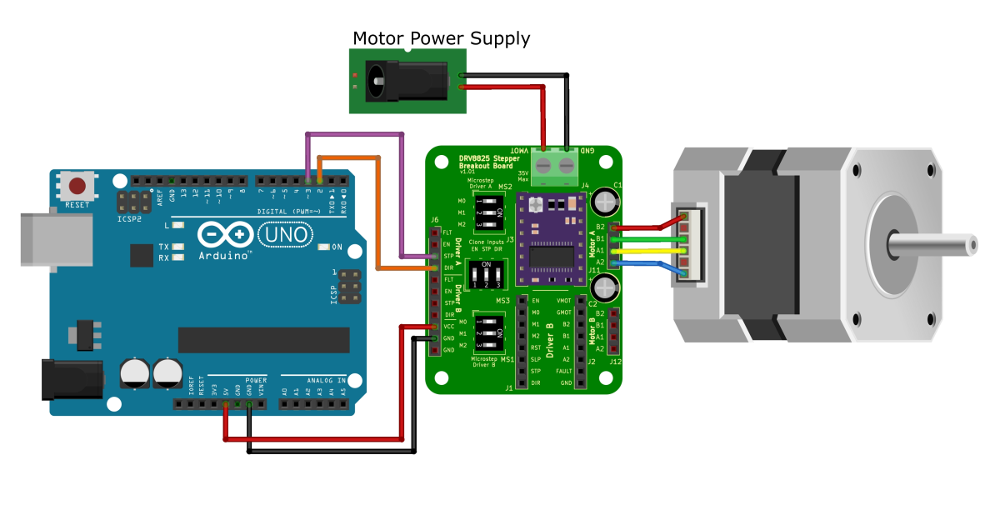

---
tags:
  - DRV8825
---

<div class="grid" markdown>

[:fontawesome-solid-arrow-left: Go Back To __Introduction__](../DRV8825%20Breakout%20Board/Introduction.md)
{ .card }

[Go Next To __Libraries__ :fontawesome-solid-arrow-right:](../DRV8825%20Breakout%20Board/libraries.md)
{ .card }

</div>

---

# Quick Start
To setup and test the DRV8825 stepper driver breakout board, follow the guide below.

---

## Equipment
You will need the following equipment:

* A DRV8825 driver module
* A DRV8825 Breakout Board
* A stepper motor
* An Arduino
* Prototype pin wire connections
* A multimeter
* Alligator clips
* A screwdriver that fits the potentiometer on the DRV8825 driver module.
* An external power source for the stepper motor. Voltage must match the stepper motor and can supply enough current to the driver/stepper motor.


<figure markdown="span">
  { max-width="100%" height: auto; loading="lazy";}
  <figcaption>You will need the equipment pictured above</figcaption>
</figure>

---

## Initial Pin Setup
!!! warning
    Disconnect power from the Arduino board and motor power supply when adding or removing pins to avoid damage to the electronics.

Once you have all the quipment listed above, you can start setting up the pin connectins

Place a single DRV8825 stepper motor driver on the breakout board. Make sure the pins of the DRV8825 module match that of the breakout board.
Connect the breakout board to Arduino microcontroller

* Connect VMOT and GMOT (Ground) to your motor power source.
* Connect your stepper motor to pins "B2", "B1", "A2", and "A1"
* Connect VCC to the 5V on to the Arduino.
* Connect one of two GND pins on the breakout board to the Arduino
* Switch the microstep switches and clone input switches to the OFF position
* The FLT and EN pins aren't used in this example

<figure markdown="span">
  { max-width="100%" height: auto; loading="lazy";}
  <figcaption>Initial Pin Setup Connections</figcaption>
</figure>

---

## Current Limiting
Before we can start using the DRV8825, the current limit needs to be set.

First calculate a voltage reference by dividing the current limit of the motor by two. For example, if a stepper motor has a current limit of 2A, the reference voltage would be 1V

$$ V_{Ref} = \frac{\text{motor current limit}}{2} $$

* Connect the STP and DIR pin on the breakout board to the 5V on the Arduino
* Turn on the motor power supply
* Take a multimeter grund probe and connect it to the extra ground in on the DRV8825 breakout board
* Take a voltage probe and connect it to a conductive screwdriver using an alligator clip
* Set the multimeter of the DC voltage setting and turn the potentiometer of the DRV8825 until the voltage on the multimeter matches the reference voltage.

<figure markdown="span">
  { max-width="100%" height: auto; loading="lazy";}
  <figcaption>Current Limiting Setup</figcaption>
</figure>

Once the current limit is set, remove the multimeter and the 5V from the step and direct pin.

!!! info
    Current limiting must be completed anytime a stepper motor or driver is changed.

---

## Arduino Code
With the current limit now set, remove the 5V from the STP and DIR pin on the breakout board and connect the pins to the Arduino pins 2 & 3, respectively.

<figure markdown="span">
  { max-width="100%" height: auto; loading="lazy";}
  <figcaption>Final pin connections to run the quick start code</figcaption>
</figure>

Copy the code below and paste it into the Arduino IDE and upload it to the Arduino.

Read the comments that explains what the code is doing.

The motor should slowly turn one direction, stop, turn faster the other direction, stop and repeat the process.

Once complete, you have started your journey of mastering the DRV8825 stepper driver.

``` arduino
// ==========================================
//              Pin Connections
// ==========================================

const int DIR_pin = 2;  // direction pin = Changes the direction the stepper motor turns
const int STP_pin = 3;  // step pin = every time the step pin is pulsed, it turns 1 step
const int steps_per_revolution = 200;

// ==========================================
//               SETUP CODE
// ==========================================
void setup(){
	// Set the DIR_pin and STP_pin as outputs
	pinMode(DIR_pin, OUTPUT);
	pinMode(STP_pin, OUTPUT);
} // End of setup loop

// ==========================================
//               MAIN LOOP CODE
// ==========================================
void loop(){
	// Set motor direction HIGH
	digitalWrite(DIR_pin, HIGH);

	// Spin motor slowly
	for(int x = 0; x < steps_per_revolution; x++){
		digitalWrite(STP_pin, HIGH);  // Pulse step pin HIGH to move to next step
		delayMicroseconds(4000);  // Small delay before turning step pin LOW
		digitalWrite(STP_pin, LOW); // Pulse the step pin LOW
		delayMicroseconds(4000);  // Small delay
	}
	delay(1000); // 1 second delay, no movement

  // Sets motor direction LOW, changing the motor direction
	digitalWrite(DIR_pin, LOW);

	// Spin motor quickly. Repeat of the slow movement code, except the delays are lower, increasing the speed
	for(int x = 0; x < steps_per_revolution; x++){
		digitalWrite(STP_pin, HIGH);
		delayMicroseconds(2000);
		digitalWrite(STP_pin, LOW);
		delayMicroseconds(2000);
	}

	delay(1000); // 1 second delay, no movement

} // End of Main loop
``` 

---
<div class="grid" markdown>

[:fontawesome-solid-arrow-left: Go Back To __Introduction__](../DRV8825%20Breakout%20Board/Introduction.md)
{ .card }

[Go Next To __Libraries__ :fontawesome-solid-arrow-right:](../DRV8825%20Breakout%20Board/libraries.md)
{ .card }

</div>

