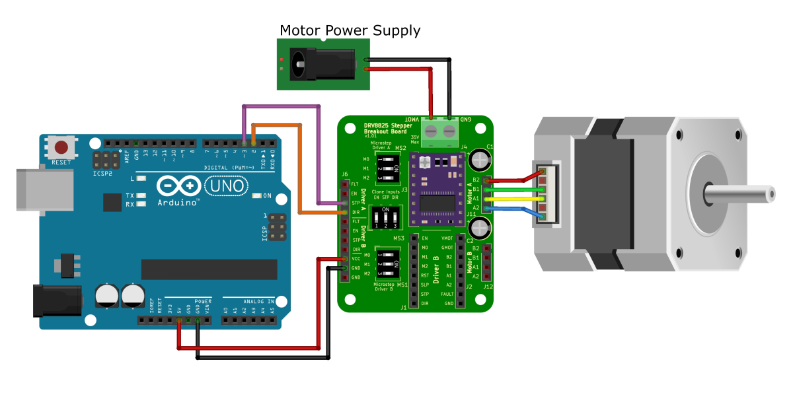
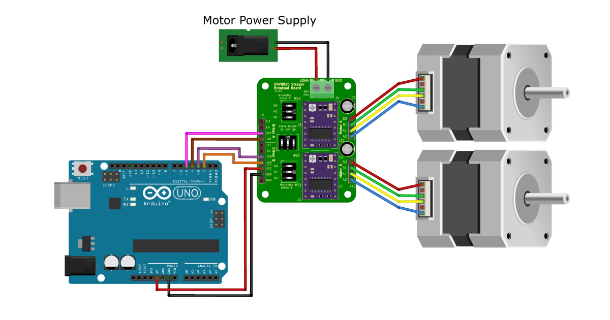

---
tags:
  - DRV8825
---

<div class="grid" markdown>

[:fontawesome-solid-arrow-left: Go Back To __Quick Start__](../DRV8825%20Breakout%20Board/Quick%20Start.md)
{ .card }

[Go Next To __Microstepping__ :fontawesome-solid-arrow-right:](../DRV8825%20Breakout%20Board/microstepping.md)
{ .card }

</div>

---

# Stepper Motor Library
For more complex stepper motor control, you would want to consider using a stepper motor library. A common stepper motor library is the [AccelStepper library](https://www.airspayce.com/mikem/arduino/AccelStepper/).

Benefits of AccelStepper include:

* Motor acceleration and deceleration capabilities
* Multiple stepper motor control
* Well documented library with examples

We will be reviewing two examples that use this library:

1. Acceleration and Deceleration of a stepper motor
2. Multi-Stepper control

---

## Example 1: Acceleration and Deceleration

### Pin Connections
The pin connections for this example is identical to that of the quick start's pin connections

<figure markdown="span">
  { max-width="100%" height: auto; loading="lazy";}
  <figcaption>Pin connections for acceleration and deceleration example</figcaption>
</figure>

### Arduino Code
Copy the code below and review the comments explaining the code.

This code should turn the motor back and forth accelerating and decellerating while doing so.

```arduino
// ==========================================
//               Libraries
// ==========================================
#include <AccelStepper.h>

// ==========================================
//               Pin Connections
// ==========================================
const int DIR_pin = 2;  // direction pin = Changes the direction the stepper motor turns
const int STP_pin = 3;  // step pin = every time the step pin is pulsed, it turns 1 step

// Accel stepper defineing motor interface type
#define motorInterfaceType 1

// Creates a stepper motor object in the code
AccelStepper stepper_OBJ(motorInterfaceType, STP_pin, DIR_pin);

// ==========================================
//               SETUP CODE
// ==========================================
void setup() {
	stepper_OBJ.setMaxSpeed(100);  // Sets max speed of the motor in steps per second
	stepper_OBJ.setAcceleration(25);  // Sets accerlation in steps per second, per second
	stepper_OBJ.setSpeed(100);  // Sets the desired speed in steps per second
	stepper_OBJ.moveTo(200);  // Sets the target position of the motor in steps
} // End of setup code

// ==========================================
//               MAIN LOOP CODE
// ==========================================
void loop() {
	// If the stepper motor is at the target positio, the position is changed to the opposite direction
	if (stepper_OBJ.distanceToGo() == 0) 
		stepper_OBJ.moveTo(-stepper_OBJ.currentPosition());

	// run() polls stepper_OBJ to see if the motor should be ran or not. Call run() as frequently as possible.
	stepper_OBJ.run();
} // End of main loop
```

---

## Example 2: Multi-Stepper Control

### Pin Connections

For this example, you will need two stepper motors and two DRV8825 motor drivers. Put both drivers on the breakout board and set the current limit before using.

<figure markdown="span">
  { max-width="100%" height: auto; loading="lazy";}
  <figcaption>Multistepper pin connection setup</figcaption>
</figure>

### Arduino Code
Copy the code below and review the comments explaining the code.

The code below should turn the motors at the same time at different speeds to different positions. Unlike the first example, the stepper motors don't accelerate or decelerate. Speed remains constant.

``` arduino
// ==========================================
//               Libraries
// ==========================================
#include <AccelStepper.h>
#include <MultiStepper.h>

// ==========================================
//               Pin Connections
// ==========================================
const int DIR_B_pin = 2;  // direction pin = Changes the direction the stepper motor turns
const int STP_B_pin = 3;  // step pin = every time the step pin is pulsed, it turns 1 step

const int DIR_A_pin = 4;
const int STP_A_pin = 5;

// Accel stepper defineing motor interface type
#define motorInterfaceType 1

// Creates a stepper motor object in the code
AccelStepper stepper_A_OBJ(motorInterfaceType, STP_A_pin, DIR_A_pin);
AccelStepper stepper_B_OBJ(motorInterfaceType, STP_B_pin, DIR_B_pin);

// Create multistepper object
MultiStepper stepper_group;

// ==========================================
//               SETUP CODE
// ==========================================
void setup() {
	// Configure each stepper
  stepper_A_OBJ.setMaxSpeed(500);  // Sets max speed of the motor to 1000.0 steps per second
  stepper_B_OBJ.setMaxSpeed(250);

  // Add stepper A and B to the stepper_group object
  stepper_group.addStepper(stepper_A_OBJ);
  stepper_group.addStepper(stepper_B_OBJ);
} // End of setup code

// ==========================================
//               MAIN LOOP CODE
// ==========================================
void loop() {
	// Empty array that will contain target steps to return
  long target_position[2];

  // Sets postions
  target_position[0] = 400;
  target_position[1] = 200;

  // Set the target positions to the stepper group
  stepper_group.moveTo(target_position);

  // Runs all stepper motors until they reach their desired position.
  // This function blocks the code until complete
  stepper_group.runSpeedToPosition();

  delay(1000); // 1 second delay

  // Repeat of the previous code with different target positions
  target_position[0] = -600;
  target_position[1] = 300;
  stepper_group.moveTo(target_position);
  stepper_group.runSpeedToPosition();
  delay(1000);

} // End of main loop
```

## Conclusion
The previous examples demonstrate some of the capabilities of the AccelStepper library. I encourage you too look at additional examples in the [AccelStepper library](https://www.airspayce.com/mikem/arduino/AccelStepper/examples.html) for additional examples.

---
<div class="grid" markdown>

[:fontawesome-solid-arrow-left: Go Back To __Quick Start__](../DRV8825%20Breakout%20Board/Quick%20Start.md)
{ .card }

[Go Next To __Microstepping__ :fontawesome-solid-arrow-right:](../DRV8825%20Breakout%20Board/microstepping.md)
{ .card }

</div>